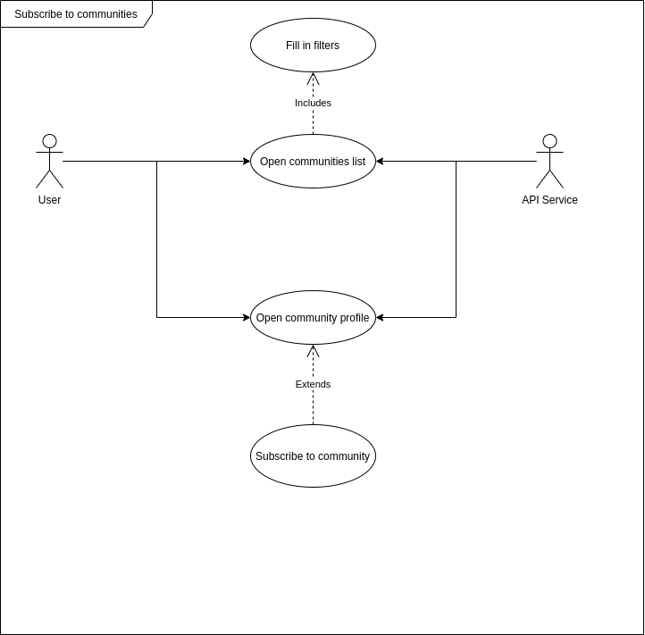
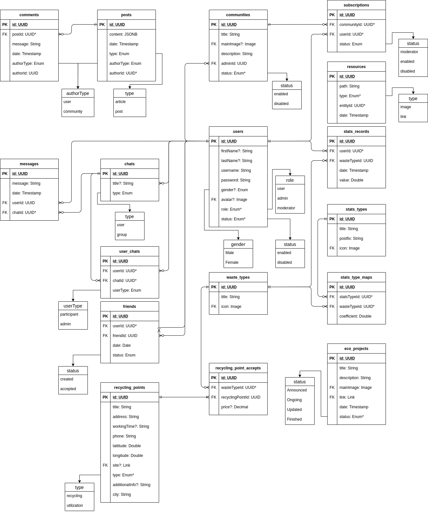

# EcoBeko's Documentation 💬

Documentation is powered by [Docsify](https://docsify.js.org), therefore main README file is located [here](src/docs/README.md) but it's preferable to access the generated docs since all the linking (images, sources) is done for generated version only, here's the link: [eco-beko.ryspekov.life/docs](https://eco-beko.ryspekov.life/docs).

If you prefer to access everything in one page, this README is about it.

Table of contents:

- [EcoBeko's Documentation 💬](#ecobekos-documentation-)
  - [Phase 2](#phase-2)
    - [Project Description 📓](#project-description-)
    - [Scope 🧐](#scope-)
    - [Tech Stack & Tools ⚙️](#tech-stack--tools-️)
      - [Frontend](#frontend)
      - [Backend](#backend)
      - [Database](#database)
    - [REST API reference 👷](#rest-api-reference-)
  - [Phase 3](#phase-3)
    - [Authorization/Registration module](#authorizationregistration-module)
    - [News module](#news-module)
    - [Friends module](#friends-module)
    - [Statistics module](#statistics-module)
    - [Messages module](#messages-module)
    - [Communities module](#communities-module)
    - [Map module](#map-module)
    - [Eco Projects module](#eco-projects-module)
    - [Administration module](#administration-module)
    - [Datasets](#datasets)
  - [Phase 4](#phase-4)
    - [Schema](#schema)
    - [Description](#description)
      - [General info](#general-info)
      - [Resources table](#resources-table)
      - [Users table](#users-table)
      - [Friends table](#friends-table)
      - [Chats (chats, user_chats, messages tables)](#chats-chats-user_chats-messages-tables)
      - [Recycling points (recycling_points, recycling_point_accepts, waste_types tables)](#recycling-points-recycling_points-recycling_point_accepts-waste_types-tables)
      - [Eco projects table](#eco-projects-table)
      - [Statistics (stats_records, stats_types, stats_type_maps, waste_types tables)](#statistics-stats_records-stats_types-stats_type_maps-waste_types-tables)
      - [Communities (communities, subscriptions tables)](#communities-communities-subscriptions-tables)
      - [Posts (posts, comments tables)](#posts-posts-comments-tables)
  - [Phase 5](#phase-5)
  - [Phase 6](#phase-6)

## Phase 2

### Project Description 📓

**EcoBeko** is a eco-activists oriented social network, where in addition to an ordinary online social interactions features, new ones are added!

Our **goal** is to build a social network with eco-specific features that could unite people, help contacting big organizations and just knowing about all the helpful activities that people around the world could share with simple articles.

This app _could potentially help_ the beginners that want to start help the planet. There are multiple ways of doing that: thoughtful consuming, collecting/sorting trash, planting trees, helping animals, engineering agricultural lands and etc. However, there is so much people can do wrong about everything, therefore, having organizations or experienced people just writing about their day-to-day routines in addition to articles that may demystify some conspiracies.

### Scope 🧐

What we want to achieve is a fully functional, standalone web application and database that could scale and handle things nicely.

We have tried to build EcoBeko before (old repositories are now archived), however we were able to have only authorization/registration with News feed, user trash recycling statistics and map containing recycling points in Almaty. Being more experienced with building stuff, we are able now to finish much more modules here.

General features/modules the system covers:

- User registration/authorization
- User profile module
- News module
- Ability to write posts
- Ability to write articles
- Friends module
- Recycling maps module
- User/Global statistics
- Eco Projects module
- Communities module

### Tech Stack & Tools ⚙️

The architecture is available [here](src/docs/architecture/README.md)

We will be building a simple client-server architecture, but there are some details.

#### Frontend

As a UI, we choose to build a web application with [Vue.js](https://vuejs.org/). We have some experience building such systems, so having web application is almost a standard. On the other side, web is growing big now.

#### Backend

REST API is the common way to go, in terms of building apps as SPA's. Having single language to work with is an advantage, so [Node.js](https://nodejs.org/en/) is an obvious choice. In order to leverage TypeScript features and to have the ability to quickly write scalable/modular API, [NestJS](https://nestjs.com/) is our choice.

#### Database

[Postgres SQL](https://www.postgresql.org/) is one of the most popular SQL database. It's Open Source nature brings a community, that any project definitely wants. Postgres is known to be a highly fault-tolerant and while comparing to the other SQL solutions, it's easy to setup and get start with.

### REST API reference 👷

API docs will be build with [Swagger](https://swagger.io/) and will be available at [/api](https://eco-beko.ryspekov.life/api) endpoint

## Phase 3

### Authorization/Registration module

1. How the system will differentiate the users, give a proper access to a certain functionalities?

The answer: by giving the users the ability to register and then authenticate themselves in our system:

### News module

1. The main reason for users to register in our system is to share or acquire the experiences across the world. How they will be able to do so?

The answer: users will be able to write regular posts in our system and share them with their friends.

1. Learning through experiences is a good way to go, however, sometimes writing just posts is not good enough as the idea of posts is similar to Twitter's tweets, little, short stories. How professionals of different degree could share stories/materials in more structured way?

The answer: users will be able to write articles in medium manner.

### Friends module

1. How do people will share the posts or articles when there's no one to read them?

The answer: users will be able to search for friends using multiple filter parameters.

1. Searching for all the closest friends you got could turn out to be pretty complicated task, how users could find friends more easily?

The answer: recommendation system based on users friends could help find their other friends too.

### Statistics module

1. Eco-friendly users often are responsible consumers or at least trying to. Sometimes, the motivation behind sorting trash is unknown, how the system will be able to motivate users to continue sorting?

The answer: visuals and strong numbers could trick our brain to understand the reason behind his actions. The system will provide a proper statistics in terms of amount of saved trees and energy also keeping track of how much KG is collected by individual user or globally.

### Messages module

1. What other ways of user activities the system could present in order to communicate with friends (beside posts and articles)?

The answer: messages module will provide a real-time way of connecting with any friend.

1. What if users will want to discuss something quick with 3 or more people instead of writing to each person?

The answer: group chats.

!> Use-case for group chats are the same, but scales with multiple users

### Communities module

1. Having a big pool of users is great, but as different people are having different eco topics that they want to cover, is there a more organized way of collecting the ideas into a single place?

The answer: subscribing to communities.

1. Having communities is great, but if single user is unable to find a community of his own thoughts and ideas, what should he do?

The answer: create and administrate his own community.

1. As communities are growing in size, it becomes difficult to administrate them singlehandedly, how the users are supposed to scale the community?

The answer: users could ask friends to become the moderator of their group, so they can perform different tasks such as editing/creating in their communities.

### Map module

1. While wanting to sort trash, it is essential to have a place to send your trash to, so that it will be utilized. How users will be able to find such places?

The answer: users could use the eco map the system provides and search for a proper place in their city.

1. There could be a bug number of recycling points across the city, how to find the proper one? (to be sure that a place can accept a certain material)

The answer: the eco map provides a way to filter places according to materials they want.

### Eco Projects module

1. There are so much is happening around the globe: eco moves, projects, activities and etc. How potentially interested people could know where or when such events are happening?

The answer: special users are able to keep track of such events and publish them in events feed.

### Administration module

1. Having at least one special kind of users (that are able to publish events), how are they being created?

The answer: another special user type with admin role (which is created by hand) is able to access admin console and perform such a task.

### Datasets

Datasets were generated after Phase 4 and are available here:

- [users.csv](src/datasets/users.csv)
- [friends.csv](src/datasets/friends.csv)
- [recycling_points.csv](src/datasets/recycling_points.csv)
- [waste_types.csv](src/datasets/waste_types.csv)
- [communities.csv](src/datasets/communities.csv)
- [recycling_points.csv](src/datasets/recycling_points.csv)
- [recycling_point_accepts.csv](src/datasets/recycling_point_accepts.csv)

> We will generate more datasets later

## Phase 4

### Schema

- [DDL queries](Ecobekter-DDL-queries.sql)
- [DML queries](Ecobekter-DML-data-load.sql)

### Description

#### General info

Enum fields are represented as a small collection of values. Image/Link fields are foreign keys to the Resources Table. Any field marked with asterisk is an indexed field.

#### Resources table

Resources table is responsible for containing image/link paths. This will be useful across an application, since using `entity_id` (entity is any table using resources) will resolve an image directly without fetching entity itself. Mostly, we thought of practicing such tables of metadata.

#### Users table

Users table contains user info, their credentials and some metadata (status, role). Usernames are unique, and passwords are hashed using `bcrypt`. As for deleting users, we won't delete them directly, instead, to ease maintaining lost id references we will mark disabled users with `status=disabled`

#### Friends table

Friends table contains users' relations, `user_id` will be used to fetch user's list of friends. In order to make it work, single friendship creates 2 rows, where `user_id` and `friend_id` will be switched

#### Chats (chats, user_chats, messages tables)

For any chat that has begun to work (user chat, group chat) one row in chat table is created. `user_chats` is responsible for mapping `user_id` to a `chat_id` (single user could have multiple chats), and stating user's role in a chat. In that way, user and group chats are stored in a same relations. Messages are produced by users and binds to a certain chat.

#### Recycling points (recycling_points, recycling_point_accepts, waste_types tables)

Recycling points table contains information about utilization/recycling points in Almaty and Nur-Sultan cities. There could be many waste types stored in the system, from which recycle points need a bridge table which maps them with waste types (single recycling point accepts multiple waste types). Recycling point can pay for a certain waste type or pay nothing at all.

#### Eco projects table

Eco project table is responsible for announcing eco projects around the globe, it contains just enough information for users to be familiar with.

#### Statistics (stats_records, stats_types, stats_type_maps, waste_types tables)

Users are able to write statistics about their sorting (Which waste type? How many kilos?), `stats_records` holds such info. There are many statistical types, for instance, all the sorted trash could be summarized in terms of how much trees are saved, how much energy is saved and etc, `stats_types` are used for that. Each stat. type is growing from a specific waste_types, `stats_type_maps` shows which waste types are contributing to which stats types. For instance, 1kg plastic is a 0.1 kWh energy saved, which means a coefficient stored in mapping is 0.1.

#### Communities (communities, subscriptions tables)

It's simple, users are able to create a community, and other users can subscribe. Admin can assign moderators to a community which could do everything admin can, except deleting community.

#### Posts (posts, comments tables)

Users are able to write posts or articles, which are stored in a json format. Author could be a user or community which could be evaluated in a procedure.

## Phase 5

Queries are available here:

- [1](phase-5/1.sql)
- [2-3](phase-5/2-3.sql)
- [4](phase-5/4.sql)
- [5](phase-5/5.sql)
- [6](phase-5/6.sql)
- [7-8](phase-5/7-8.sql)
- [9](phase-5/9.sql)
- [10](phase-5/10.sql)
- [11](phase-5/11.sql)
- [12-13](phase-5/12-13.sql)
- [14](phase-5/14.sql)
- [15](phase-5/15.sql)

## Phase 6

Application link: [https://eco-beko.ryspekov.life/app](https://eco-beko.ryspekov.life/app)
Rest API reference: [https://eco-beko.ryspekov.life/api](https://eco-beko.ryspekov.life/api)
PG Admin console: [http://eco-beko.ryspekov.life:5480/browser/](http://eco-beko.ryspekov.life:5480/browser/)
