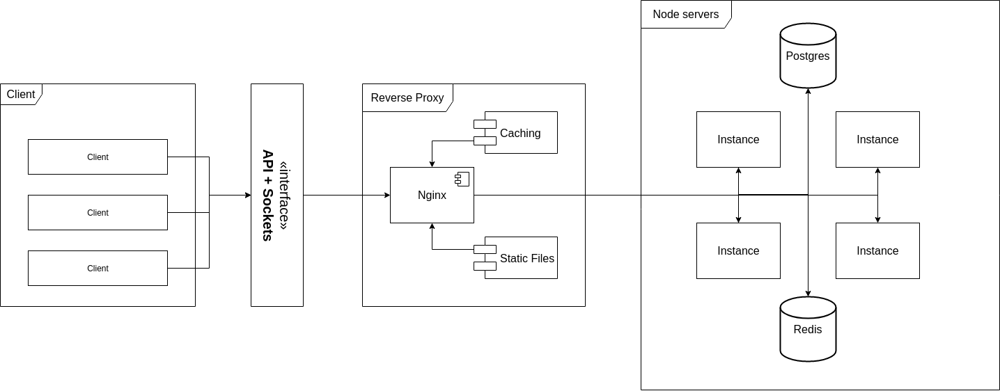

# Архитектура

Верхний уровень системы выглядит так:

- Клиент сидит за абстракцией API и Сокетов для соединения в режиме реального времени
- Сервер сидит за обратным прокси предоставляемым Nginx
- Nginx отдает статические файлы, кеширует запросы (настройка ip_hashing для сокетов) и балансирует нагрузку между запущенными узлами Node.js (далее узлы)
- Все узлы подключены к локальной MongoDB
