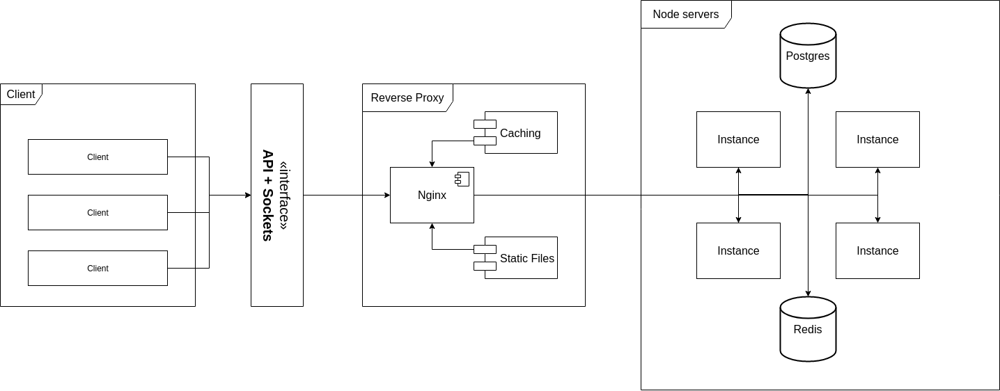

# Architecture

From top-level the whole system looks like this:

- API consumer (or Client) is accessing the Reverse-Proxy Nginx server for resources like: static files, API
- Nginx server serves static files and proxies the requests into internal REST API server
- Pm2 runs multiple instances of REST API (Nodes), creates single endpoint for Nginx to forward to, then it balances the requests between created nodes.
- Sessions (organized by Redis) and PostgreSQL are shared across all Nodes
